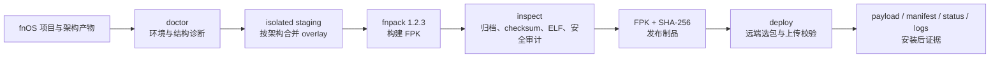
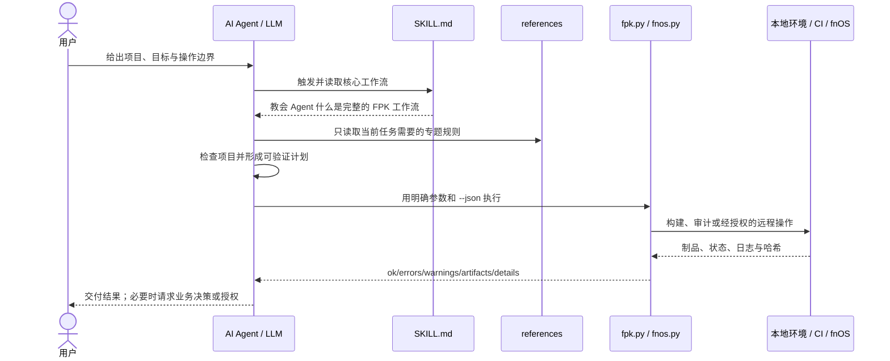

<div align="center">

# 🧰 fnOS FPK Builder Skill

**面向飞牛 OS 应用的构建、审计、CI 与远程生命周期工具箱**

从项目骨架到多架构 FPK，从供应链校验到 fnOS 实机验证，提供一条可重复、可审计、默认安全的交付路径。

<p>
  
  
  
  
  
  
  <a href="LICENSE"></a>
</p>

[快速开始](#-快速开始) · [能力概览](#-能力概览) · [Agent 协作](#-agent-如何理解并完成-fpk-打包) · [命令参考](#-命令参考) · [安全设计](#-安全设计) · [项目结构](#-项目结构) · [开源协议](#-开源协议)

</div>

---

## ✨ 项目简介

`fn-fpk-builder-skill` 是一套中文优先、同时适合 Codex Agent 与开发者直接使用的 fnOS FPK 工具。

它把容易出错的操作固化为标准库 Python 命令：

- 创建官方 native 或 Docker FPK 项目骨架。
- 校验 manifest、配置、图标、生命周期脚本和目录结构。
- 在隔离 staging 中构建 amd64、arm64 或架构无关包。
- 审计 FPK 内外层归档、checksum、ELF 架构和敏感文件。
- 生成稳定命名的 `.fpk` 与 `.sha256` 制品。
- 通过 SSH 安全部署、卸载重装更新、查看状态与日志。
- 在唯一隔离应用中执行实机冒烟测试并检查残留。
- 为 GitHub Actions 提供固定版本、固定哈希的发布模板。

> [!IMPORTANT]
> 构建主机架构与 FPK 目标架构彼此独立。可以在 macOS arm64 或 Linux amd64 上组装 fnOS amd64 与 arm64 包，但包内原生二进制必须提前按目标平台正确构建。

## 🧭 工作流



构建过程不会原地重写源项目的 manifest、应用目录或预构建产物。每个目标架构使用独立临时 staging，完成后再对最终 FPK 进行一次反向审计。

## 🚀 快速开始

### 1. 检查运行环境

需要 Python 3.10 或更高版本。核心命令只使用 Python 标准库。

```bash
python3 --version
python3 scripts/fpk.py toolchain --install --json
```

`toolchain --install` 会下载与当前主机匹配的官方 fnpack 1.2.3，并核对项目内置 SHA-256 后才允许使用。

### 2. 初始化项目

创建官方 native 模板：

```bash
python3 scripts/fpk.py init my-fnos-app \
  --template native \
  --path ./packages \
  --json
```

创建 Docker 模板：

```bash
python3 scripts/fpk.py init my-fnos-app \
  --template docker \
  --path ./packages \
  --json
```

### 3. 诊断与审计源项目

```bash
python3 scripts/fpk.py doctor \
  --project ./packages/my-fnos-app \
  --target-arch amd64 \
  --json

python3 scripts/fpk.py inspect \
  ./packages/my-fnos-app \
  --target-arch amd64 \
  --json
```

先修复所有 `errors`，再评估 `warnings` 是否符合应用真实需求。

### 4. 构建双架构 FPK

假设公共 FPK 项目位于 `./package`，两个目录中已经放好对应架构的应用产物：

```bash
python3 scripts/fpk.py build \
  --project ./package \
  --out ./dist/fpk \
  --arch both \
  --overlay-amd64 ./artifacts/amd64 \
  --overlay-arm64 ./artifacts/arm64 \
  --json
```

输出命名固定为：

```text
{appname}-{version}-fnos-amd64.fpk
{appname}-{version}-fnos-amd64.fpk.sha256
{appname}-{version}-fnos-arm64.fpk
{appname}-{version}-fnos-arm64.fpk.sha256
```

纯脚本或静态资源项目可以使用 `--arch all`。只要包内存在特定架构原生二进制，就必须生成独立架构包。

### 5. 独立审计最终制品

```bash
python3 scripts/fpk.py inspect \
  ./dist/fpk/my-fnos-app-1.0.0-fnos-amd64.fpk \
  --target-arch amd64 \
  --json
```

### 6. 部署到 fnOS

先配置目标，不要把设备地址写进仓库：

```bash
export FNOS_HOST="root@fnos-host"

python3 scripts/fnos.py doctor --json
python3 scripts/fnos.py deploy --json ./dist/fpk
```

`deploy` 会根据远端 `uname -m` 自动选择匹配的 FPK，并校验上传 SHA-256。若目标应用已安装，它会固定执行 stop、uninstall、确认 `noinstall`、install；不会尝试原位升级。随后验证：

- 安装目录全部普通文件的 SHA-256 与数量。
- 包内和安装后 manifest 的精确哈希与版本。
- appcenter 与 `cmd/main status` 合约所代表的运行状态。
- 经高置信规则脱敏后的关键日志。

`--clean` 只为旧调用兼容保留，不再改变部署行为。单独卸载仍需要 `--yes`：

```bash
python3 scripts/fnos.py uninstall \
  --yes \
  --json \
  my-fnos-app
```

## 🎯 能力概览

| 领域 | 能力 | 默认策略 |
| --- | --- | --- |
| 工具链 | 下载、识别并验证 fnpack | 固定 1.2.3 与 SHA-256 |
| 项目初始化 | native、Docker、无 UI 变体 | 调用官方 fnpack 模板 |
| 构建 | amd64、arm64、all、双架构 | 隔离 staging，不修改源项目 |
| Manifest | 必填项、版本、依赖、端口、布尔值、路径 | 语法与语义双重校验 |
| 归档 | 外层 FPK、内层 `app.tgz`、路径与链接 | 不信任输入，不直接解压 |
| 二进制 | ELF class、endianness、machine、执行位 | 拒绝 Mach-O、PE 和混合架构 |
| 供应链 | fnpack、Actions、FPK、payload 哈希 | 固定来源并输出证据 |
| 远程部署 | 选包、上传、卸载重装、回滚 | 禁止原位升级，回滚包必须显式指定 |
| 运维 | 状态、启停、日志、卸载 | 同时解释退出码和语义输出 |
| 冒烟测试 | 构建到残留清理的完整生命周期 | 唯一测试 app ID，不碰现有应用 |

### 支持矩阵

| 执行主机 | 支持级别 | 说明 |
| --- | --- | --- |
| macOS arm64 | ✅ 正式支持 | 使用已校验 `darwin-arm64` fnpack |
| macOS amd64 | ✅ 正式支持 | 使用已校验 `darwin-amd64` fnpack |
| Linux amd64 | ✅ 正式支持 | 推荐用于干净 CI 组包 |
| Linux arm64 | ⚠️ 有条件支持 | 官方 fnpack 1.2.3 URL 当前缺失，需显式提供可信工具 |
| Windows amd64 | ℹ️ 诊断支持 | 不维护第二套 PowerShell 构建实现 |

支持的 FPK 形态包括 native、Docker、纯静态资源，以及 Go、Rust、Node.js、Python、Java 等项目准备好的目标架构产物。

## ⌨️ 命令参考

### FPK 构建与审计

| 命令 | 用途 |
| --- | --- |
| `fpk.py toolchain` | 检查或安装经过哈希验证的 fnpack |
| `fpk.py init` | 创建官方 native 或 Docker 项目 |
| `fpk.py doctor` | 诊断主机、工具链与项目就绪状态 |
| `fpk.py build` | 隔离组装、构建、审计、命名并生成哈希 |
| `fpk.py inspect` | 审计项目目录或最终 `.fpk` |
| `fpk.py sources` | 显示来源账本或检查内容漂移 |
| `icon_fit.py` | 生成并同步 fnOS 根级/UI 图标，支持官方 squircle 曲线与 legacy r20/r80 圆角 |

### fnOS 远程生命周期

| 命令 | 用途 |
| --- | --- |
| `fnos.py doctor` | 检查设备架构和 appcenter-cli |
| `fnos.py deploy` | 自动选包、上传、卸载重装并收集证据 |
| `fnos.py status` | 查询应用状态 |
| `fnos.py verify-web-app` | 联合校验 AppCenter 状态、DB URL、UI config、容器/进程、端口和 HTTP health |
| `fnos.py logs` | 安全发现或读取应用日志 |
| `fnos.py start` | 启动应用并解释语义结果 |
| `fnos.py stop` | 停止应用并解释语义结果 |
| `fnos.py uninstall` | 经显式确认后卸载并验证 `noinstall` |
| `fnos.py smoke` | 对唯一临时应用执行隔离实机冒烟测试 |

所有子命令都支持 `--help` 和 `--json`：

```bash
python3 scripts/fpk.py build --help
python3 scripts/fnos.py deploy --help
```

JSON 输出统一为：

```json
{
  "ok": true,
  "errors": [],
  "warnings": [],
  "artifacts": [],
  "details": {}
}
```

退出码约定：

| 退出码 | 含义 |
| --- | --- |
| `0` | 成功 |
| `1` | 校验失败或远程操作失败 |
| `2` | 参数错误或环境不可用 |

## 🛡️ 安全设计

这个项目把 FPK、项目目录和远端命令输出都视为不可信输入。

关键防线包括：

- 拒绝绝对路径、路径穿越、重复归档条目、特殊节点和危险符号链接。
- 校验 `manifest.checksum` 是否等于精确 `app.tgz` 字节的 MD5。
- 对外层 FPK 生成独立 SHA-256；MD5 只承担 fnpack 格式一致性用途。
- 扫描 `.DS_Store`、密钥、环境文件、源码缓存和常见无关文件泄漏。
- 扫描 `app/`、`cmd/`、CGI、共享库、native addon 等所有可能的原生二进制。
- 禁止含本机二进制的包声明 `platform=all`。
- SSH 保留主机密钥校验，远端临时目录按任务隔离。
- 部署启动前校验完整 payload；卸载命令返回后必须确认 `noinstall`。
- 已安装目标必须先卸载并确认 `noinstall`；`--yes` 和 `--rollback-fpk` 仍需调用者显式选择。

远程验证默认使用 `/var/apps/{appname}` 等稳定接口，不依赖某台设备当前的物理卷路径。

完整安全模型见 [references/security.md](references/security.md)。

## 🤝 Agent 如何理解并完成 FPK 打包

### 目前达到目标了吗？

> [!NOTE]
> **已经达到目标。** 这里的目标不是聊天，而是让 Agent 正确理解“打包 FPK”的完整含义，并能与用户配合完成分析、准备、构建、审计、部署和验证。

Agent 获得的不是一条孤立的 `fnpack build` 命令，而是一套可执行的 fnOS 工程知识：

- 知道源码项目、应用构建产物、FPK 包目录和最终 `.fpk` 不是同一个层次。
- 知道先识别项目已有构建方式，再准备目标架构产物，不能凭空发明 prebuild。
- 知道 manifest、`cmd/`、`config/`、wizard、图标和 `app/` 各自承担什么职责。
- 知道 amd64 与 arm64 是包内产物的目标架构，不是当前 Mac/Linux 主机架构的简单复制。
- 知道必须在隔离 staging 中组装，不能为了打包原地篡改项目。
- 知道 fnpack 退出成功不等于制品正确，还要反向审计归档、checksum、ELF 和敏感文件。
- 知道部署不是“上传后结束”，而要继续验证 payload、manifest、版本、状态和日志。
- 知道哪些信息可以从项目中自行发现，哪些业务选择或危险操作必须交给用户决定。

Agent 宿主负责加载本 Skill 并提供文件、终端和可选 SSH 工具；本项目本身不需要调用模型 API。

### Agent 对“打包 FPK”的认知模型


用户说“帮我打包 FPK”时，Agent 应把它理解为上面的完整链路，并根据项目现状决定从哪一步开始，而不是默认项目已经满足 fnOS 包结构。

| 用户表达 | Agent 应理解为 |
| --- | --- |
| “把这个项目打成 FPK” | 先识别应用构建方式与 FPK 包根目录；缺少包结构时初始化或补齐，再构建和审计 |
| “打一个 ARM 包” | 准备真正的 Linux AArch64 产物，设置 `platform=arm`，拒绝混入 x86_64/Mach-O |
| “同时支持 x86 和 ARM” | 分别准备两个 overlay 并生成两个包；不能只改文件名或 manifest |
| “这个 FPK 能不能发布” | 对最终包做独立只读审计，输出错误、警告、架构和哈希证据 |
| “装到飞牛上试试” | 先确认设备、应用和授权，匹配架构后部署，并验证安装后的真实状态 |
| “更新失败就回滚” | 更新固定走卸载重装；只使用用户明确提供且已审计的旧 FPK，不猜测上一版本 |

### 协作架构



这里的关键不是让 Agent 自由拼凑 shell，而是让它理解项目后做高层判断，同时把归档、架构、哈希和生命周期等脆弱环节交给低自由度工具。

### 各方职责

| 参与者 | 负责 | 不应负责 |
| --- | --- | --- |
| 用户 | 给出目标、项目位置、目标架构、设备和授权范围 | 猜测底层 fnpack 或 appcenter 细节 |
| AI Agent | 识别任务、读取对应规则、检查项目、调用工具、解释证据并持续修正 | 绕过确认、伪造成功、静默扩大操作范围 |
| `SKILL.md` | 提供触发语义、路由、核心流程和安全不变量 | 承载所有详细文档 |
| `references/` | 按需提供 manifest、架构、CI、远程和安全知识 | 一次性全部塞入模型上下文 |
| `fpk.py` / `fnos.py` | 执行可重复校验和受控操作，返回结构化结果 | 代替 Agent 理解业务目标 |
| fnOS / CI | 运行被明确选择的命令并返回真实状态 | 为不完整参数作主观推断 |

### 用户提供什么，Agent 自己发现什么

用户不需要掌握 fnpack 的所有细节。双方最有效的分工是：

| 用户最好明确提供 | Agent 应优先自行发现 |
| --- | --- |
| 项目路径和最终目标 | 仓库语言、monorepo 布局与现有构建入口 |
| 新应用的 appname、版本和产品名称 | FPK 包根目录、现有 manifest 和生命周期脚本 |
| 需要 amd64、arm64、all 或双架构 | 包内是否存在 ELF、Mach-O、PE 或原生依赖 |
| native、Docker、静态资源等产品形态 | 已准备产物、可复用 CI 和 overlay 目录 |
| UI、端口、权限、共享目录等产品需求 | fnpack 可用性、主机能力和结构缺陷 |
| 是否允许连接、安装/更新（含卸载重装）或独立卸载 fnOS 应用 | 哪些检查可以只读完成以及能够生成哪些证据 |

Agent 只有在下面这些信息无法从项目可靠推导时才应暂停询问：

- 会改变应用身份、数据兼容性或用户体验的产品选择。
- 多种包根目录或构建入口都合理，选择结果会改变交付物。
- 需要新增 root、网络、共享目录、CGI 或统一网关暴露。
- 需要连接哪台 fnOS、操作哪个 appname 或安装到哪个卷。
- 是否允许对指定应用执行必需的卸载重装、回滚、发布或隔离实机 smoke。

对普通缺陷，Agent 应直接给出证据并修复；对会扩大权限或改变产品语义的选择，Agent 应把选项和影响交给用户。

### 在 Codex 中安装和触发

将仓库放入 Codex Skills 目录：

```bash
git clone https://github.com/<your-org>/fn-fpk-builder-skill.git \
  "${CODEX_HOME:-$HOME/.codex}/skills/fn-fpk-builder-skill"
```

开发本地副本时，也可以把当前目录链接到 Skills 目录。确保最终目录名与 `SKILL.md` 中的名称一致：

```bash
mkdir -p "${CODEX_HOME:-$HOME/.codex}/skills"
ln -s /absolute/path/to/fn-fpk-builder-skill \
  "${CODEX_HOME:-$HOME/.codex}/skills/fn-fpk-builder-skill"
```

然后在对话中显式触发：

```text
使用 $fn-fpk-builder-skill 检查这个项目，并构建 amd64 与 arm64 的 fnOS FPK。
```

Codex 会先根据 [agents/openai.yaml](agents/openai.yaml) 和 [SKILL.md](SKILL.md) 识别能力，再按任务读取单层 `references/`。详细规范不会无条件占用模型上下文。

### 推荐的任务描述

高质量请求最好同时给出五类信息：

```text
使用 $fn-fpk-builder-skill。

项目：/absolute/path/to/project
目标：构建 amd64 与 arm64 FPK，并独立审计最终制品
已有产物：amd64 在 ./artifacts/amd64，arm64 在 ./artifacts/arm64
允许：修改当前项目的 CI 和 package 目录
禁止：连接 NAS、发布 GitHub Release、修改现有应用
交付：FPK、SHA-256、JSON 审计报告和未解决警告
```

Agent 在信息不足但可以安全诊断时会先执行只读检查；如果缺失信息会改变制品、远程目标或破坏性操作范围，应暂停并询问用户，而不是自行猜测。

### 常见协作请求

只读诊断：

```text
使用 $fn-fpk-builder-skill 审计 incoming 目录中的所有 FPK。
把它们视为不可信输入，只生成 JSON 报告，不修复、不重打包、不安装。
```

多架构构建：

```text
使用 $fn-fpk-builder-skill 读取项目现有构建脚本，准备 amd64/arm64 overlay，
在隔离 staging 中构建两个 FPK。不要修改源 manifest，并报告两个包的架构证据和 SHA-256。
```

CI 迁移：

```text
使用 $fn-fpk-builder-skill 把现有发布流程迁移到 GitHub Actions。
保留项目自己的应用构建命令，只替换 FPK 组装和审计阶段，不发布 Release。
```

受控部署：

```text
使用 $fn-fpk-builder-skill 部署到 FNOS_HOST。
允许对 test-app 执行卸载重装并读取日志；禁止卸载其他应用或猜测回滚包。
安装后验证 payload、manifest、版本和 running 状态。
```

### Agent 操作协议

一次可靠协作应遵循以下闭环：

1. **理解**：把“打包 FPK”拆成应用构建、包结构、架构组装、fnpack 和制品审计。
2. **识别**：确认包根目录、现有构建命令、目标架构和用户授权。
3. **路由**：只加载当前任务所需 reference，例如跨架构任务读取构建文档，远程任务读取部署与安全文档。
4. **诊断**：先运行 `doctor` 或 `inspect`，以真实项目状态修正计划。
5. **准备**：调用项目自己的构建入口生成目标架构应用产物，再放入明确 overlay。
6. **执行**：本地构建使用隔离 staging；远程操作只作用于明确设备和 appname。
7. **解析**：优先使用 `--json`，同时解释退出码、`errors`、`warnings`、`artifacts` 和 `details`。
8. **验证**：不要把“命令退出 0”当作完成；继续核对最终 FPK、哈希、架构、安装 payload、manifest、状态和日志。
9. **汇报**：向用户列出做了什么、没有做什么、产物位置、证据和剩余风险。
10. **迭代**：失败时只修复对应知识、项目、工具或兼容性层，再运行定向测试和全量验证。

### 人在回路与权限边界

| 操作 | Agent 默认行为 | 需要用户明确授权 |
| --- | --- | --- |
| 阅读项目、文档和现有配置 | 可以执行 | 否 |
| `doctor`、`inspect`、来源检查 | 可以执行 | 否 |
| 在用户指定项目中创建或构建 FPK | 按请求执行 | 需要用户已要求构建或修改 |
| 连接 fnOS 并读取状态 | 先确认目标在任务范围内 | 是 |
| 安装或更新指定应用 | 验证目标与制品后执行；已安装目标固定先卸载 | 是 |
| 独立卸载、回滚 | 默认禁止 | 是，且必须明确目标/参数 |
| 隔离实机 smoke | 只使用唯一测试 app ID | 是 |
| 操作现有生产应用或共享数据 | 不推断授权 | 必须单独明确 |

脚本还会在命令层强制关键护栏：部署已安装应用时必须卸载并确认 `noinstall` 后才能安装；独立卸载缺少 `--yes` 时返回参数错误；回滚必须提供 `--rollback-fpk`。

### 与其他 Agent 框架集成

其他支持文件读取和命令执行的 Agent 也可以使用本项目，但不会自动获得 Codex 的 Skill 发现机制。宿主至少要做到：

1. 在 fnOS 相关任务开始时把 `SKILL.md` 提供给模型。
2. 允许模型按链接读取所需 `references/`，而不是预加载全部资料。
3. 将 `scripts/fpk.py` 和 `scripts/fnos.py` 暴露为受控命令工具。
4. 捕获退出码和 `--json` 标准输出，不只截取人类可读文本。
5. 在 SSH、安装、卸载和 smoke 前实施宿主侧权限确认。
6. 将工作目录、文件修改范围和网络权限明确告诉 Agent。

一个最小宿主提示可以写成：

```text
处理 fnOS/FPK 任务前，完整读取 /path/to/fn-fpk-builder-skill/SKILL.md。
遵循其中的 reference 路由和安全不变量。
调用脚本时优先使用 --json；不得声称未被工具或设备证据验证的结果。
任何远程变更、uninstall 或 smoke 都必须先取得用户明确授权；部署已安装应用的授权必须涵盖该目标的卸载重装。
```

集成点是 Skill 文档和稳定 CLI/JSON 契约：Agent 负责理解并操作，脚本负责确定性执行。

### 多 Agent 协作

复杂发布可以拆成三个互相校验的角色：


- 构建 Agent 不把自己的成功日志当作独立审计。
- 审计 Agent 只读取最终制品和必要规则，避免被构建结论污染。
- 部署 Agent 只接收已经审计的 FPK，并重新校验传输与安装后状态。
- Agent 之间通过 FPK、`.sha256` 和标准 JSON 报告交接，不通过模糊自然语言声称“应该没问题”。

仓库中的 [evals/protocol.md](evals/protocol.md) 和 [evals/prompts.json](evals/prompts.json) 已采用类似模式，对新项目、双架构构建、CI、恶意包审计、远程卸载重装和破坏性操作护栏进行前向测试。

## 🔁 CI 与自动化

可复制的 GitHub Actions 模板位于：

- [assets/github-actions/fpk.yml](assets/github-actions/fpk.yml)

模板将应用产物准备和 FPK 组包装在不同阶段：

1. 分别准备 Linux amd64 与 arm64 应用产物。
2. 以带哈希的 overlay 元数据传递文件及执行位。
3. 在干净 Ubuntu amd64 环境下载并校验 fnpack。
4. 组装、审计两个 FPK 和 `.sha256`。
5. 上传 FPK、哈希和 JSON 审计报告。

所有 GitHub Actions 均固定到完整提交 SHA，不依赖 runner 恰好存在的工具。

## 🧪 验证状态

当前实现已经通过：

- macOS arm64 连续两轮完整测试：每轮 `63/63`。
- Linux amd64 clean-room：`63/63`。
- 官方 native 与 Docker 模板真实 fnpack 构建。
- amd64 与 arm64 FPK 的独立反向审计。
- 错误架构、checksum 损坏、路径穿越、危险链接、敏感文件等负面测试。
- Skill Creator `quick_validate.py`。
- 用户授权 fnOS 设备上的隔离安装、启动、状态、日志、停止、卸载与残留检查。

复现本地测试：

```bash
export FNPACK_BIN="$HOME/.cache/fn-fpk-builder-skill/fnpack/1.2.3/$(uname -s | tr '[:upper:]' '[:lower:]')-arm64/fnpack"
python3 -m unittest discover -s tests -v
```

如果主机不是 macOS arm64，请先执行 `toolchain --install`，再使用其 JSON 输出中的实际 `artifacts[0].path` 设置 `FNPACK_BIN`。

实现与 Loop 证据见 [evals/loop-results.json](evals/loop-results.json)，工具和来源哈希见 [references/provenance.json](references/provenance.json)。

## 🗂️ 项目结构

```text
.
├── SKILL.md                         # Agent 路由与核心工作流
├── README.md                        # 面向开发者的中文入口
├── LICENSE                          # MIT 开源协议
├── agents/openai.yaml               # Codex UI 元数据
├── scripts/
│   ├── fpk.py                       # 本地构建与审计 CLI
│   ├── fnos.py                      # 远程生命周期 CLI
│   └── fpk_lib/                     # manifest、归档、工具链与远程基础库
├── references/                      # 按需加载的 fnOS 专题规范
├── assets/github-actions/fpk.yml    # 可复制的发布流水线
├── assets/install-runbook/reinstall.sh  # 测试装机四步的可执行脚本（带离线测试）
├── tests/                           # 标准库 unittest 与真实 fnpack 集成测试
├── evals/                           # 前向测试、评分和 Loop 证据
└── .github/workflows/ci.yml         # 项目自身 CI
```

## 📚 深入阅读

| 文档 | 内容 |
| --- | --- |
| [官方契约](references/official-contract.md) | manifest、目录、生命周期、UI、wizard、权限与资源 |
| [构建与架构](references/build-and-architecture.md) | fnpack、staging、overlay、ELF 与语言接入 |
| [CI 发布](references/ci-release.md) | 干净环境、多架构产物和 GitHub Actions |
| [公开发布净化](references/public-release-hygiene.md) | GitHub/FnDepot 发布前排除测试报告、设备信息、日志和凭据 |
| [Docker 应用全流程](references/docker-app-flow.md) | Docker Web FPK 构建、生命周期、端口配置、AppCenter 启停和验证方法 |
| [Native 端口设置闭环](references/native-web-port-flow.md) | 向导改端口后 `config_init`/`config_callback`/`ui/config`/DB/监听五处一致 |
| [虚拟机承载型应用](references/vm-app-flow.md) | libvirt/KVM FPK：190 秒回调看门狗与秒回模式、平台启停真机语义、磁盘与网卡身份、地址寻踪闸门、串口自救、反代链接改写 |
| [离线回归与真机取证](references/offline-and-live-testing.md) | 打桩戒律、结构不变量用例、抽源桩测、留痕取证、录屏、文档渲染校验 |
| [FPK 测试装机单](references/install-runbook.md) | stop → uninstall → install → start 标准四步、装机落点分层、入口表与图标取证、失败判读与数据保全 |
| [入口图标设计方法论](references/entry-icon-design.md) | 细线/字母品牌标在 ~52px 桌面可读的设计流程：画稿定规范、笔画层级、按槽位光学重绘、深浅底双墨色、64/32/16 闸门 |
| [实机案例](references/case-studies.md) | Docker Web、Native 端口闭环、虚拟机承载型三类的完整交付链路、被排除的死路与验收清单 |
| [远程测试](references/remote-testing.md) | 部署、卸载重装、日志、回滚与隔离烟测 |
| [AppCenter 状态 runbook](references/appcenter-state-db-runbook.md) | 联合校验 AppCenter 状态、DB URL、UI config、wizard 回显和真实运行态 |
| [远端临时补丁规范](references/temporary-remote-patches.md) | 记录调试补丁、备份、验证、回滚与是否固化进源码 |
| [安全模型](references/security.md) | 归档、密钥、权限、供应链与破坏性操作 |
| [故障排查](references/troubleshooting.md) | 常见构建、架构、安装和运行问题（含 Docker Web、Native Web、虚拟机承载型三类实机沉淀） |
| [来源账本](references/provenance.json) | 官方文档、fnpack、参考项目与实机证据 |

## 📌 设计边界

- 不替代 Go、Rust、Node.js、Python 或 Docker 的目标架构构建系统。
- 不执行项目未声明的任意 prebuild shell。
- 不把 Windows 作为正式自动化构建主机。
- 不猜测回滚制品，不静默降低哈希或 SSH 安全策略。
- 不发布 Marketplace、不操作 GitHub 远端，除非得到单独授权。

## 📄 开源协议

本项目基于 [MIT License](LICENSE) 开源。

---

<div align="center">

**让每一个 FPK 都能说明：它从哪里来、里面有什么、为何可以安装。**

</div>
